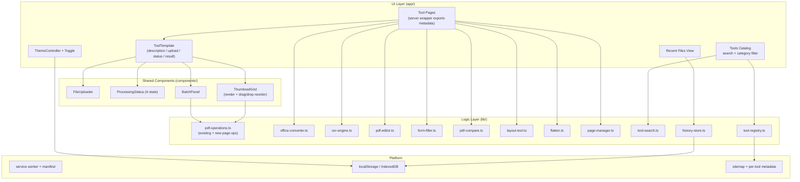

# Design Document: PDFy Feature Expansion

## Overview

This design extends PDFy — a privacy-first, 100% client-side PDF toolkit (Next.js 16 App Router with static export, React 19, Tailwind CSS 4, TypeScript) — with nine new PDF tools, seven UX/platform improvements, and two SEO/growth items.

The single hard constraint that shapes every decision below is the **privacy guarantee**: all processing happens in the browser, no file bytes or metadata ever leave the device, and the build remains a static export (`output: 'export'`) with no server-side runtime. This rules out server-side conversion services and commercial cloud SDKs, and it forces some document conversions (PDF ↔ Office) to be implemented as best-effort, fidelity-bounded transformations rather than pixel-perfect conversions.

The existing codebase already establishes the patterns this design builds on:

- PDF read/write via `pdf-lib` and rendering via `pdfjs-dist` (`lib/pdf-operations.ts`).
- Raster pipelines via `jspdf` + `html2canvas` (used by `compressPDF`, `htmlToPDF`).
- Tool pages under `app/tools/<tool>/page.tsx`, each a `"use client"` component composed of `FileUploader` + `ProcessingStatus`.
- A four-state processing model (`idle | processing | success | error`) already used informally across tool pages.

### Research Summary

Key technical decisions were validated against current client-side tooling:

- **OCR**: [Tesseract.js](https://github.com/naptha/tesseract.js) is a pure JS/WASM OCR engine that runs entirely in the browser with no server calls. The standard pattern (render PDF pages to canvas with pdf.js → OCR each canvas → embed an invisible text layer over the original page image) is well established ([Dynamsoft Web OCR tutorial](https://dynamsoft.com/codepool/free-web-ocr-image-pdf.html), [Simon Willison's browser OCR tool](https://simonwillison.net/2024/Mar/30/ocr-pdfs-images/)). Content was rephrased for compliance with licensing restrictions.
- **PDF ↔ Office**: High-fidelity in-browser conversion is only offered by commercial SDKs (e.g. Nutrient/PSPDFKit) which are incompatible with our privacy/no-license constraint. Open-source client-side libraries exist for each leg — [SheetJS](https://sheetjs.com) (xlsx parse/write), `mammoth` (docx→HTML), `docx` (HTML/structure→docx), `pptxgenjs` (pptx write), and `jszip` for raw OOXML — but none preserve full layout fidelity. The design therefore treats Office conversion as **structure/content extraction with an explicit fidelity-limitation notice**, which matches the boundary the requirements set (Req 1.5). Content was rephrased for compliance with licensing restrictions.
- **PWA on static export**: A hand-authored `manifest.webmanifest` plus a `sw.js` placed in `public/` are emitted verbatim by the Next static export and require no server runtime (Req 13.7). Workbox-style precaching is implemented manually to keep build compatibility with Next 16 + Turbopack.
- **Comparison & visual diff**: pdf.js text extraction feeds a Myers-style line/word diff for text mode; per-page canvas rasterization feeds a pixel-comparison pass (pixelmatch-style) for visual mode.

### Design Goals

1. Preserve the privacy guarantee end-to-end (no network egress of user content).
2. Keep all new code static-export compatible (no server actions, no route handlers for processing).
3. Concentrate pure, testable logic in `lib/` so it can be property-tested independently of the DOM.
4. Reduce duplication across the growing tool set via a shared `ToolTemplate` and a single tool registry.
5. Match the existing visual identity (green accent `#009966`, Tailwind, minimal UI) and add dark mode without regressions.

## Architecture

PDFy remains a client-only SPA-style static site. The expansion introduces a clearer layering so that the heavy, testable logic is isolated from React and the DOM.



### Layering Principles

- **`lib/` modules are pure where possible.** Functions accept `File`/`ArrayBuffer`/`Uint8Array` and typed options and return `Uint8Array` or plain data. They never touch React state. Where a DOM API is unavoidable (canvas rendering for OCR/compress/visual-diff), it is isolated behind a single function and the surrounding planning logic (page selection, ordering, padding, clamping, validation) is kept as separate pure helpers so it can be property-tested without a browser.
- **UI orchestrates, lib computes.** Tool pages collect input, call a `lib` function, and feed the result into `ToolTemplate`'s four-state model.
- **No new server surface.** All new capabilities are client modules dynamically `import()`-ed (matching the existing lazy-loading of `pdfjs-dist`, `jspdf`, `html2canvas`) to keep initial bundle size and offline caching manageable.

### Worker Strategy

CPU-heavy operations (OCR, batch processing, visual diff) run with cooperative yielding and progress callbacks. Tesseract.js manages its own worker. For batch and OCR loops, processing is chunked per-file/per-page with `await` yields so the UI thread can paint progress (satisfying the periodic-update requirements 1.4, 2.3, 12.3). Web Workers may be used for diff/layout if profiling shows jank, but are not required by the contract.

## Components and Interfaces

### Tool Registry (`lib/tool-registry.ts`)

A single source of truth for the tool catalog, replacing the inline array in `app/tools/page.tsx`. It drives the catalog grid, search/filter, sitemap generation, per-tool metadata defaults, and README synchronization.

```typescript
export type ToolCategory =
  | "Convert" | "Edit" | "Organize" | "Optimize" | "Security" | "View";

export interface ToolDefinition {
  slug: string;              // e.g. "ocr" -> /tools/ocr
  name: string;              // display name (matches README + catalog)
  description: string;       // one-line description (matches README + catalog)
  category: ToolCategory;
  icon: string;              // path key into lib/icons.ts
  seoTitle: string;          // 10–60 chars, unique
  seoDescription: string;    // 50–160 chars, unique
  ogImage?: string;          // falls back to site default
  isNew?: boolean;
}

export const TOOLS: readonly ToolDefinition[];
export function getTool(slug: string): ToolDefinition | undefined;
export const CATEGORIES: readonly ToolCategory[]; // includes synthetic "All"
```

### ToolTemplate (`components/ToolTemplate.tsx`)

Reusable layout enforcing the four-region structure (Req 15). Pure presentation + state container; the operation logic is injected.

```typescript
export type ToolStatus = "idle" | "processing" | "success" | "error";

export interface ToolTemplateProps {
  title: string;
  description: string;
  accept?: string;
  multiple?: boolean;
  // operation receives selected files, reports progress, returns a result
  onRun: (files: File[], onProgress: (p: Progress) => void) => Promise<ToolResult>;
  children?: React.ReactNode; // tool-specific controls rendered in the upload region
}

export interface Progress { current: number; total: number; label?: string; }
export interface ToolResult {
  downloads: { filename: string; data: Uint8Array | Blob }[];
  notices?: string[];        // e.g. fidelity-limitation messages
}
```

Regions rendered top-to-bottom: **description → upload area → processing status → result/download**. In `idle`, the status and result regions are hidden (Req 15.4). On success, the result region shows downloads + notices (Req 15.5). On error, status shows the message and selected files are retained (Req 15.6). Styling preserves `#009966` and dark-mode classes (Req 15.3).

### Page Manager (`lib/page-manager.ts`)

Pure page-level planning + pdf-lib execution shared by delete/extract, crop/resize, and reorder.

```typescript
// Pure planners (no DOM, no pdf-lib) -> property-tested directly
export function planDeletion(totalPages: number, selected: number[]):
  { keepIndices: number[] } | { error: "none-selected" | "all-selected" };
export function planExtraction(totalPages: number, selected: number[]):
  { keepIndices: number[] } | { error: "none-selected" };
export function clampCropRect(rect: Rect, pageW: number, pageH: number):
  { rect: Rect } | { error: "degenerate" };
export function validateScale(scale: number):
  { ok: true } | { ok: false; value: number };

// Executors (pdf-lib)
export function buildSubsetPdf(file: File, keepIndices: number[]): Promise<Uint8Array>;
export function applyCrop(file: File, regions: PageCrop[]): Promise<Uint8Array>;
export function applyResize(file: File, spec: ResizeSpec): Promise<Uint8Array>;
export function reorderPdf(file: File, order: number[]): Promise<Uint8Array>;
```

Notes: deletion/extraction use `keepIndices` derived in ascending order to preserve relative order (Req 6.1, 6.2). Crop sets the page CropBox (not deletion of content) so out-of-crop content stays unrendered but present (Req 7.1). Crop rect is clamped to page bounds (Req 7.5) and rejected when degenerate (Req 7.6).

### Layout Tool (`lib/layout-tool.ts`)

```typescript
export type NupCount = 2 | 4 | 6 | 8 | 9 | 16;

// Pure imposition planners
export function planNup(pageCount: number, n: NupCount):
  { sheets: (number | "blank")[][] };          // cells per sheet, reading order
export function planBooklet(pageCount: number):
  { paddedCount: number; sequence: (number | "blank")[] };

// Executors
export function buildNup(file: File, n: NupCount): Promise<Uint8Array>;
export function buildBooklet(file: File): Promise<Uint8Array>;
```

`planNup` pads with `"blank"` cells so each sheet is full (Req 8.5) and orders left-to-right, top-to-bottom preserving source sequence (Req 8.1). `planBooklet` pads to a multiple of 4 (Req 8.6) and emits the fold-ordered sequence (Req 8.3). Both reject empty input upstream (Req 8.7). Page scaling into cells is uniform/aspect-preserving in the executor (Req 8.2).

### OCR Engine (`lib/ocr-engine.ts`)

```typescript
export interface OcrResult {
  pdf: Uint8Array;            // searchable PDF
  pagesWithNoText: number[];  // 1-based
}
export function runOcr(
  file: File,
  onProgress: (p: { page: number; total: number; pct: number }) => void,
  opts?: { lang?: string }
): Promise<OcrResult>;
```

Pipeline: validate/parse with pdf.js (reject invalid — Req 2.6); for each page render to canvas, recognize with Tesseract.js (abort with clear error if the WASM engine fails to load — Req 2.7), then rebuild output preserving each original page image, count, and dimensions and overlaying a selectable text layer positioned over recognized regions (Req 2.2). Pages yielding no text keep their original image and are reported (Req 2.5). Progress updates per page within the required cadence (Req 2.3).

### Office Converter (`lib/office-converter.ts`)

```typescript
export type OfficeFormat = "docx" | "xlsx" | "pptx";
export interface ConversionResult { data: Uint8Array; filename: string; fidelityNotices: string[]; }

export function pdfToOffice(file: File, target: OfficeFormat,
  onProgress: (pct: number) => void): Promise<ConversionResult>;
export function officeToPdf(file: File,
  onProgress: (pct: number) => void): Promise<ConversionResult>;

export function detectSourceFormat(file: File): "pdf" | OfficeFormat | "unknown";
```

All conversion is client-side (Req 1.3). Source-format and 100 MB / parseability checks gate processing (Req 1.6, 1.7). Because exact layout reproduction is not achievable client-side, every conversion returns `fidelityNotices` listing affected formatting categories, surfaced before download (Req 1.5); a UI failure to show the notice does not block download (Req 1.8). Implementation per leg: PDF→docx/pptx via pdf.js text+image extraction into `docx`/`pptxgenjs`; PDF→xlsx via tabular text heuristics into SheetJS; docx→PDF via `mammoth`→HTML→existing `htmlToPDF`; xlsx→PDF via SheetJS→HTML table→`htmlToPDF`; pptx→PDF via slide XML/image extraction→pdf-lib pages.

### PDF Editor (`lib/pdf-editor.ts`)

```typescript
export type Edit =
  | { kind: "text"; page: number; x: number; y: number; text: string; size: number }
  | { kind: "rect"; page: number; rect: Rect; color?: RGB }
  | { kind: "line"; page: number; from: Point; to: Point; color?: RGB }
  | { kind: "redact"; page: number; rect: Rect };

export function validateEdit(edit: Edit, pageW: number, pageH: number):
  { ok: true } | { ok: false; reason: "out-of-bounds" | "too-long" };
export function applyEdits(file: File, edits: Edit[]): Promise<Uint8Array>;
```

Text boxes accept 1–5,000 chars within page bounds (Req 3.1); invalid position/length is rejected leaving content unchanged (Req 3.2). Redaction **removes** intersecting text from the content stream (not just covers it) so it is unrecoverable via extraction/copy (Req 3.4) **and** draws an opaque mark (Req 3.5). With zero edits, the original bytes are returned unchanged (Req 3.7).

### Form Filler (`lib/form-filler.ts`)

```typescript
export interface FieldInfo { name: string; type: FieldType; options?: string[]; }
export function detectFields(file: File): Promise<FieldInfo[]>;        // [] when none
export function validateFieldValue(field: FieldInfo, value: string):
  { ok: true } | { ok: false; reason: "too-long" | "invalid-option" };
export function fillForm(file: File, values: Record<string, string>): Promise<Uint8Array>;
```

Uses pdf-lib's form API. Unnamed fields get unique placeholder labels (Req 4.2). Text > 10,000 chars rejected per-field, others retained (Req 4.4); values outside a field's option set rejected per-field (Req 4.5). No-fields and detection-error states produce distinct messages (Req 4.7, 4.8).

### PDF Comparator (`lib/pdf-compare.ts`)

```typescript
export type PageStatus = "unchanged" | "modified" | "added" | "removed";
export interface CompareResult {
  pages: { page: number; status: PageStatus }[];
  textDiffs: { page: number; added: string[]; removed: string[] }[];
  visualDiffs?: { page: number; regions: Rect[] }[];
  identical: boolean;
}
export function comparePdfs(a: File, b: File, mode: "text" | "visual" | "both"):
  Promise<CompareResult>;
```

Per-page status accounts for differing page counts (extra pages → added/removed; common pages compared — Req 4 of Req 5). Text mode reports added/removed segments by page (Req 5.2); visual mode highlights differing rendered regions (Req 5.3). Identical inputs (or no text+no visual diffs) report no differences (Req 5.6). Invalid/corrupt and password-protected inputs are rejected with distinct messages (Req 5.7, 5.8).

### Flatten Tool (`lib/flatten.ts`)

```typescript
export function flattenPdf(file: File):
  Promise<{ data: Uint8Array } | { error: "nothing-to-flatten" }>;
```

Renders AcroForm field values and annotation appearances into static page content and removes the interactive objects so the output has zero interactive fields/annotations (Req 9.1, 9.2), preserving coordinates/dimensions/orientation within 1pt and page count/order (Req 9.3). Returns `nothing-to-flatten` when there is nothing to do (Req 9.5).

### Thumbnail Grid (`components/ThumbnailGrid.tsx` + `lib/thumbnails.ts`)

Renders per-page thumbnails with pdf.js (lazy per viewport), shows a per-page loading indicator (Req 11.2) and a placeholder on render failure without aborting the rest (Req 11.3). Supports drag-and-drop reordering with a drop-target indicator (Req 11.4) and updates displayed order quickly (Req 11.5). The displayed order array is the single source of truth handed to executors, guaranteeing output order equals displayed order (Req 11.6).

```typescript
// pure reorder used by the grid and property-tested
export function moveItem<T>(arr: T[], from: number, to: number): T[];
```

### Batch Processor (`components/BatchPanel.tsx` + `lib/batch.ts`)

```typescript
export type FileStatus = "queued" | "processing" | "completed" | "failed";
export interface BatchItem { file: File; status: FileStatus; error?: string; output?: Uint8Array; }

export function validateBatch(files: File[]):
  { ok: true } | { ok: false; reason: "too-many" | "none" | "too-large"; };
export function runBatch(
  files: File[],
  op: (f: File) => Promise<Uint8Array>,
  onUpdate: (items: BatchItem[]) => void
): Promise<BatchItem[]>;
export function zipResults(items: BatchItem[]): Promise<Blob>;
```

Limits: 1–100 files, ≤100 MB each (Req 12.1, 12.2). Each file processed independently; a failure marks that item `failed` and the batch continues (Req 12.5). On terminal state, individual downloads + a single archive are offered (Req 12.4) via `jszip`.

### History Store (`lib/history-store.ts`)

```typescript
export interface HistoryEntry { fileName: string; tool: string; timestamp: number; }
export function recordEntry(e: HistoryEntry):
  { ok: true } | { ok: false; reason: "storage-error" };
export function listEntries(): HistoryEntry[];   // most-recent first
export function clearHistory(): void;

// pure helper, property-tested
export function applyEntry(entries: HistoryEntry[], e: HistoryEntry): HistoryEntry[];
```

`applyEntry` truncates `fileName` to 255 chars (Req 14.1), prepends, and caps the list at 50 by evicting the least-recent (Req 14.2). Listing is sorted most-recent-first (Req 14.3). Storage failures leave existing entries unchanged and signal the error (Req 14.6). Data stays in the browser (Req 14.7).

### Theme Controller (`components/ThemeController.tsx`)

Tailwind `class` dark mode. A tiny inline script in `app/layout.tsx` applies the persisted/`prefers-color-scheme` theme before first paint (Req 16.3, 16.4) to avoid FOUC. Toggling persists to localStorage and flips the root class (Req 16.1, 16.2). `matchMedia` listener tracks OS changes while unset (Req 16.5). Storage read/write failure falls back to OS preference without interrupting use (Req 16.6).

```typescript
export function resolveTheme(stored: "light" | "dark" | null, osPrefersDark: boolean):
  "light" | "dark";
```

### SEO Metadata & Sitemap

Each tool page becomes a thin **server component** that `export const metadata` (Next Metadata API) derived from the tool registry, wrapping the existing `"use client"` UI. A site-level default fills any missing title/description/OG image (Req 17.3). `app/sitemap.ts` enumerates the registry + static pages to emit absolute URLs in the static export (Req 17.5, 17.6).

```typescript
export function buildToolMetadata(tool: ToolDefinition, siteDefaults: SiteDefaults): Metadata;
```

### PWA Layer

`public/manifest.webmanifest` (name, 192/512 icons, start_url, `display: standalone`) + `public/sw.js` registered from a small client component. The SW precaches the app shell and tool assets and serves them offline (Req 13.1–13.3), shows an "unavailable offline" message for uncached requests without crashing (Req 13.4), exposes an offline indicator (Req 13.5), and updates caches on next online load (Req 13.6). Both files are static-export artifacts (Req 13.7).

## Data Models

```typescript
export interface Rect { x: number; y: number; width: number; height: number; }
export interface Point { x: number; y: number; }
export interface RGB { r: number; g: number; b: number; } // 0..1 (pdf-lib)

export interface PageCrop { page: number; rect: Rect; }
export interface ResizeSpec {
  mode: "size" | "scale";
  target?: { width: number; height: number };
  scale?: number;            // 0.1..10.0
  proportional: boolean;
  applyToAll: boolean;
}

export interface SiteDefaults {
  title: string; description: string; ogImage: string; baseUrl: string;
}
```

Persistence:

- **localStorage** keys: `pdfy.theme` (`"light" | "dark"`), `pdfy.history` (JSON array of `HistoryEntry`, max 50).
- **Cache Storage** (service worker): versioned cache name `pdfy-shell-v{n}` for app shell + tool chunks.

No data model is persisted server-side; all storage is browser-local (Req 13, 14, 16).

## Correctness Properties

*A property is a characteristic or behavior that should hold true across all valid executions of a system — essentially, a formal statement about what the system should do. Properties serve as the bridge between human-readable specifications and machine-verifiable correctness guarantees.*

The properties below were derived from the prework analysis and consolidated to remove redundancy. They focus on the pure, testable logic in `lib/` (page planning, imposition, validation, history, search, theme, metadata). Whole-pipeline fidelity, timing, rendering, and infrastructure criteria are covered by example/integration/smoke tests in the Testing Strategy instead.

### Property 1: Deletion keeps the ascending complement

*For any* total page count and any selected subset that is neither empty nor the full set, `planDeletion` returns `keepIndices` equal to the sorted complement of the selection, and the resulting document's page count equals `total − |selected|` with remaining pages in ascending relative order.

**Validates: Requirements 6.1**

### Property 2: Extraction keeps exactly the selection in order

*For any* total page count and any non-empty selected subset, `planExtraction` returns `keepIndices` equal to the selection sorted ascending, and the output contains exactly those pages in original relative order.

**Validates: Requirements 6.2**

### Property 3: Page-operation guards reject empty and total-delete selections

*For any* total page count, `planDeletion` and `planExtraction` return a `none-selected` error when the selection is empty, and `planDeletion` returns an `all-selected` error when the selection equals the full page set; in every guarded case no output document is produced.

**Validates: Requirements 6.4, 6.5**

### Property 4: Crop region is always clamped within page bounds or rejected

*For any* crop rectangle and page dimensions, `clampCropRect` either returns a rectangle lying entirely within `[0,0,pageW,pageH]`, or returns a `degenerate` error when the clamped width or height is zero or negative.

**Validates: Requirements 7.5, 7.6**

### Property 5: Scale validation accepts exactly the supported range

*For any* scale factor, `validateScale` returns ok if and only if the factor is within `[0.1, 10.0]` inclusive, and rejects every value outside the range identifying the invalid value.

**Validates: Requirements 7.7**

### Property 6: Proportional resize scales both dimensions equally

*For any* page dimensions and any valid scale factor (or applied to every page when "apply to all" is set), proportional resize produces output dimensions equal to the originals multiplied by the scale, preserving the aspect ratio.

**Validates: Requirements 7.2, 7.3**

### Property 7: N-up preserves source order and pads to a full multiple

*For any* page count and N-up count `n ∈ {2,4,6,8,9,16}`, concatenating the cells across all sheets in reading order and dropping blank cells reproduces the source page sequence exactly, and the total number of cells is the smallest multiple of `n` that is ≥ the page count (extra cells are blank).

**Validates: Requirements 8.1, 8.5**

### Property 8: Booklet imposition is a valid padded permutation

*For any* page count, `planBooklet` produces `paddedCount` equal to the smallest multiple of 4 that is ≥ the page count, and the output sequence is a permutation of `[0..paddedCount)` (with added positions marked blank) following the standard two-up center-fold imposition order.

**Validates: Requirements 8.3, 8.6**

### Property 9: Editor embeds valid added content; rejects invalid

*For any* in-bounds text box of 1–5,000 characters, rectangle, or line, `applyEdits` produces an output that embeds the added content at the requested position; and *for any* position outside page bounds or text longer than 5,000 characters, `validateEdit` rejects the edit and the page content is left unchanged.

**Validates: Requirements 3.1, 3.2, 3.3**

### Property 10: Redaction makes covered text unrecoverable

*For any* PDF page and redaction region, text extracted from the output excludes every text segment whose bounding box intersected the redaction region (the removed text is not recoverable via extraction or copy).

**Validates: Requirements 3.4**

### Property 11: Editing with no edits is the identity

*For any* valid PDF, applying an empty list of edits returns a document equivalent to the original.

**Validates: Requirements 3.7**

### Property 12: Detected fields match the form's fields with unique labels

*For any* PDF built with a known set of AcroForm fields, `detectFields` returns exactly those fields with matching names and types, and every returned label is unique and non-empty (including synthesized placeholders for unnamed fields).

**Validates: Requirements 4.1, 4.2**

### Property 13: Filling then reading back yields the written values

*For any* form and any set of valid field values, filling the form and then reading the fields from the output yields exactly the provided values.

**Validates: Requirements 4.3**

### Property 14: Field-value validation rejects over-length and out-of-set values

*For any* text value longer than 10,000 characters `validateFieldValue` rejects it as `too-long`, and *for any* value not in a field's defined option set it rejects it as `invalid-option`, while values for other fields are unaffected.

**Validates: Requirements 4.4, 4.5**

### Property 15: Comparison accounts for every page exactly once

*For any* two PDFs (including unequal page counts), every page appears exactly once in the per-page result with a valid status, pages present in both documents are classified `unchanged` or `modified`, and pages present in only one document are classified `added` or `removed`.

**Validates: Requirements 5.1, 5.4**

### Property 16: Identical documents report no differences

*For any* PDF, comparing it against itself (or an exact clone) reports `identical = true` with no text differences and no visual differences.

**Validates: Requirements 5.6**

### Property 17: Text diff reconstructs the per-page changes

*For any* pair of documents, the reported added and removed text segments per page, when applied to the first document's page text, reproduce the second document's page text.

**Validates: Requirements 5.2**

### Property 18: OCR preserves page structure

*For any* input PDF (with the recognizer mocked), the searchable-PDF output preserves the page count and each page's dimensions and original visual content while adding a text layer.

**Validates: Requirements 2.2**

### Property 19: OCR reports and preserves pages with no recognized text

*For any* subset of pages for which the recognizer yields no text, `pagesWithNoText` equals exactly that subset and those pages' original images are retained unchanged in the output.

**Validates: Requirements 2.5**

### Property 20: Flatten removes all interactive objects and preserves pagination

*For any* PDF containing AcroForm fields and/or annotations, the flattened output contains zero interactive AcroForm fields and zero interactive annotations while preserving the original page count and page order.

**Validates: Requirements 9.1, 9.2, 9.3**

### Property 21: Search and category filtering returns exactly the matching tools

*For any* search query and active category, the catalog result is exactly the set of tools that both match the query (case-insensitive substring of name or description; a whitespace-only query matches all) and belong to the active category (the synthetic "All" category matches every tool).

**Validates: Requirements 10.1, 10.2, 10.3, 10.4, 10.5**

### Property 22: Reordering is a multiset-preserving permutation honored by output

*For any* page list and any sequence of move operations, `moveItem` preserves the multiset of pages and yields the requested order, and `reorderPdf` produces an output whose page order equals the supplied display order array exactly.

**Validates: Requirements 11.6**

### Property 23: Batch validation enforces the documented limits

*For any* set of input files, `validateBatch` returns `too-many` when there are more than 100 files, `none` when there are zero, and `too-large` when any file exceeds 100 MB; otherwise it accepts.

**Validates: Requirements 12.2**

### Property 24: Batch produces one result per success and reaches terminal status for all

*For any* valid batch with a mocked operation, on completion every item's status is `completed` or `failed`, the count of `completed` plus `failed` equals the total, and the number of output results equals the number of successfully processed files.

**Validates: Requirements 12.1, 12.3**

### Property 25: A failing file does not halt the batch

*For any* valid batch in which an arbitrary subset of files is mocked to fail, exactly those files end in `failed` and all remaining files end in `completed`.

**Validates: Requirements 12.5**

### Property 26: History store enforces truncation, cap, and ordering

*For any* sequence of recorded entries, `applyEntry` stores each file name truncated to at most 255 characters, the stored list never exceeds 50 entries (evicting the least-recent), and listing returns entries ordered from most-recent to least-recent timestamp.

**Validates: Requirements 14.1, 14.2, 14.3**

### Property 27: Theme resolution and persistence round-trip

*For any* persisted theme value, `resolveTheme` returns that value regardless of OS preference; *for any* OS preference with no persisted value, `resolveTheme` returns the value matching the OS preference; and a toggled theme value round-trips through storage so the same value is resolved on reload.

**Validates: Requirements 16.1, 16.2, 16.4**

### Property 28: Tool metadata is complete and consistent

*For any* tool, `buildToolMetadata` produces non-empty title, description, and Open Graph image (filling site defaults for missing fields), an Open Graph title and description equal to the page title and meta description, and a canonical/Open Graph URL that is absolute and ends with the tool's `/tools/<slug>` path, including Open Graph type and a single image reference.

**Validates: Requirements 17.2, 17.3, 17.4**

### Property 29: Tool titles and descriptions are well-formed and unique

*For any* tool in the registry, its SEO title length is within `[10, 60]` and its meta description length is within `[50, 160]`, and across all tools no two share an identical title or identical description.

**Validates: Requirements 17.1**

### Property 30: Sitemap contains exactly one absolute URL per public page

*For any* registry plus the set of static public pages, the generated sitemap contains exactly one entry per public page (one per tool), every entry URL is absolute, and no non-public or redirected page is included.

**Validates: Requirements 17.5, 17.6**

### Property 31: README and tool catalog are equal sets

*For any* state of the tool registry, parsing the README's tool list yields a set of `{name, description}` entries (compared with leading/trailing whitespace trimmed) exactly equal to the registry's set — no missing, extra, or mismatched entries, and equal counts.

**Validates: Requirements 18.1, 18.2, 18.4**

### Property 32: ToolTemplate status is always exactly one of four states

*For any* sequence of template events, the processing status is always exactly one of `idle | processing | success | error`, and whenever the status is `idle` both the processing-status region and the result/download region are hidden.

**Validates: Requirements 15.4**

### Property 33: Office conversion gates unsupported and oversized inputs

*For any* file whose detected type is not a valid source for the selected conversion, the converter returns an unsupported-format error (with the accepted list) and produces no output; and *for any* file exceeding 100 MB, the converter rejects it with a specific error and produces no output.

**Validates: Requirements 1.6, 1.7**

## Error Handling

The expansion uses a consistent, privacy-preserving error model. Errors never leak file contents to logs that could be transmitted, and every failure leaves the user's selection intact so they can retry.

### Error Categories

- **Validation errors (pre-processing).** Pure validators (`validateEdit`, `validateScale`, `validateFieldValue`, `validateBatch`, `clampCropRect`, `planDeletion`/`planExtraction` guards, `detectSourceFormat`) return typed discriminated results rather than throwing. The UI maps each reason to a user-facing message and stays in/returns to a safe state. The original document/selection is retained unchanged (Req 1.7, 3.2, 4.4, 4.5, 6.4, 6.5, 7.6, 7.7, 12.2, 15.6).
- **Parse/format errors.** Invalid, corrupt, or password-protected inputs are caught at load time (pdf.js / pdf-lib throw) and surfaced with a specific, distinguishable message (Req 2.6, 3.8, 5.7, 5.8). Password-protected detection reuses the pattern already in `decryptPDF`.
- **Engine/initialization errors.** WASM/engine load failures (Tesseract.js, Office libs) abort the operation, leave the input unchanged, and show a clear "could not start" message (Req 2.7); a distinct message separates "engine failed" from "no fillable fields"/"nothing to flatten" (Req 4.7, 4.8, 9.5, 9.6).
- **Empty/no-op results.** Operations with nothing to do return an explicit sentinel (`nothing-to-flatten`, empty field list, no-differences) rather than an error, and produce no modified output where required (Req 3.7, 5.6, 9.5).
- **Storage errors.** History and theme writes wrap localStorage access in try/catch; on quota/availability failure the prior state is preserved and a non-blocking notice is shown, with theme falling back to OS preference (Req 14.6, 16.6).
- **Per-item errors (batch).** A single file's failure is captured on its `BatchItem` and the loop continues; the file and reason are reported without halting the run (Req 12.5).
- **Notice-display failure.** If the fidelity-limitation notice cannot render, conversion still proceeds and the download is produced (Req 1.8).
- **Offline/uncached.** The service worker returns a graceful "feature unavailable offline" response for uncached requests so the app does not crash (Req 13.4).

### Cross-Cutting Rules

- Validators return results; only truly exceptional/IO paths throw, and throws are caught at the tool-page boundary and converted into the `error` state of `ToolTemplate`.
- No error path uploads or transmits file content (privacy guarantee across all requirements).
- Error messages are specific enough to be distinguishable per the requirements (e.g. unsupported-format vs oversized vs corrupt; no-fields vs detection-error).

## Testing Strategy

A dual approach is used: **property-based tests** verify the universal properties above across many generated inputs, and **example/integration/smoke tests** cover concrete scenarios, rendering, timing, and infrastructure that are not amenable to PBT.

### Property-Based Testing

- **Library:** [fast-check](https://github.com/dubzzz/fast-check) with the existing test runner (Vitest is recommended for a Next/TS project; Jest is acceptable). fast-check is the standard PBT library for TypeScript — it MUST NOT be reimplemented.
- **Iterations:** each property test runs a minimum of 100 generated cases (`fc.assert(fc.property(...), { numRuns: 100 })`).
- **Tagging:** each property test is tagged with a comment referencing the design property, in the format:
  `// Feature: pdfy-feature-expansion, Property {number}: {property_text}`
- **One test per property:** each of Properties 1–33 is implemented by a single property-based test.
- **Generators:** custom arbitraries for page-index sets (for deletion/extraction/reorder), `Rect`/`Point` (for crop/edit), scale factors spanning and exceeding `[0.1,10]`, file-count/size sets (for batch), tool registries and queries (for search/SEO/README), and history-entry sequences. Heavy executors (OCR recognizer, Office libs, pdf.js rendering) are **mocked** so the planning/structure logic is exercised cheaply at 100+ iterations; real-engine behavior is validated separately by example tests.
- **Edge cases folded into generators:** empty/whitespace strings, unicode/non-ASCII text, zero/negative crop dimensions, page counts that are and are not multiples of `n`/4, unnamed form fields, unequal page counts, and 0/1/50/51/100/101 history and batch sizes.

### Example-Based Unit Tests

Cover concrete, non-universal behavior: Office conversion of representative sample files (1.1, 1.2, 1.5, 1.8), OCR of a fixture scanned page with known text (2.1, 2.7), redaction opaque-mark presence (3.5), detection-error messaging (4.8), visual-diff highlighting on a known change (5.3), crop CropBox/MediaBox behavior (7.1), N-up uniform-scale placement (8.2), flatten failure path (9.6), zero-match search messaging (10.6), thumbnail loading/placeholder/drag indicators (11.1–11.5), batch archive download (12.4), offline messaging/indicator (13.4, 13.5), template region order/style/success/error rendering (15.1–15.3, 15.5, 15.6), and theme pre-render application and OS-change handling (16.3, 16.5, 16.6).

### Integration Tests

For service-worker caching and offline parity (13.2, 13.3, 13.6) — run 1–3 representative scenarios (load online, go offline, reload; verify cached op output matches online) rather than many iterations, since behavior does not vary meaningfully with input.

### Smoke Tests

Single-execution checks: no external network egress during any operation (1.3, 2.4, 3.6, 4.6, 5.5, 6.3, 7.4, 8.4, 11.7, 12.6, 14.7, 15.7), manifest field/SW-registration presence and static-export emission (13.1, 13.7), and the README privacy statement (18.3).

### Why PBT Applies Here

The `lib/` layer is dominated by pure functions over large input spaces (page-index sets, rectangles, scale factors, imposition counts, tool registries, history sequences) with clear universal properties — complements, permutations, clamping, range validation, LRU caps, set equality. These are exactly the cost-effective, high-value targets for property testing. The parts that are **not** suited to PBT — Office/OCR fidelity (engine-dependent), rendering and drag-and-drop UI, timing thresholds, and service-worker/PWA infrastructure — are deliberately routed to example, integration, and smoke tests above.
